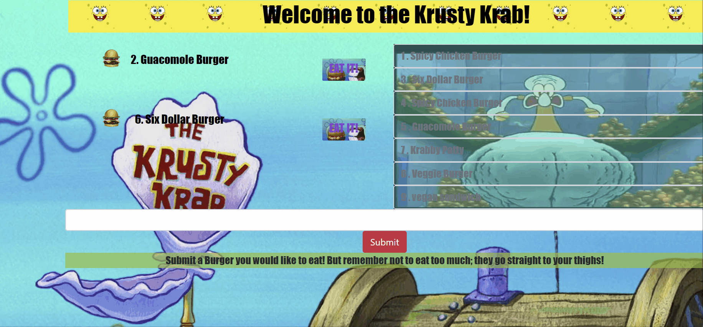

# Burger App :hamburger: :hamburger:
***

##Description :notebook: :spoon:
    I ask of you to think of a burger you'd like to try; by submitting it into the input field. Once entered,
    your burger will appear in the the left column of the page. After you come up with a couple juicy burgers,
    there will be an option in the middle of the screen to VIRTUALLY eat them! YUM!! As for the right column,
    that's basically your stomach. It will display the burgers you've ate at this point.
****

##Demonstration :eyes::eyes:

##Technology Used :robot: :computer:
* Javascript
* MySQL
* HTML
* Node Packages:
  *  express
  *  express-handlebars